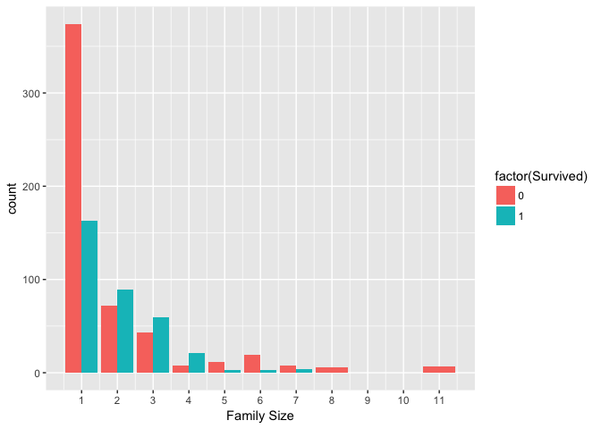
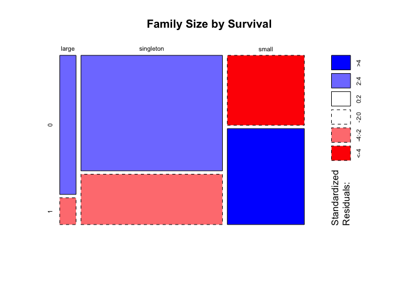

Titanic Kaggle Competition
================

Exploring Machine Learning with Kaggle's Titanic Competition
------------------------------------------------------------

Here's my code for Kaggle's introductory machine learning competition. Let's see who is going to live and who is going down with the ship

Feature Engineering
-------------------

Here is the code to grab the title, Mr., Mrs, etc., from the name variable and create a new variable called title. I also am creating a variable called Fsize that is the family size, including the person. I also standardize Mlle, Ms, Mme and "rare titles."

``` r
library(knitr)
full <- full %>%
  mutate(Title = (gsub('(.*, )|(\\..*)', '', Name)),
         Surname = (gsub('(,)(.)*', '', Name)),
         Fsize = (SibSp + Parch + 1),
         Family = paste(Surname, Fsize, sep = '_')
         )

# Titles with very low cell counts to be combined to "rare" level
rare_title <- c('Dona', 'Lady', 'the Countess','Capt', 'Col', 'Don', 
                'Dr', 'Major', 'Rev', 'Sir', 'Jonkheer')

# Also reassign mlle, ms, and mme accordingly
full$Title[full$Title == 'Mlle']        <- 'Miss' 
full$Title[full$Title == 'Ms']          <- 'Miss'
full$Title[full$Title == 'Mme']         <- 'Mrs' 
full$Title[full$Title %in% rare_title]  <- 'Rare Title'

# Show title counts by sex again
table(full$Sex, full$Title)
```

    ##         
    ##          Master Miss  Mr Mrs Rare Title
    ##   female      0  264   0 198          4
    ##   male       61    0 757   0         25

Here's a bar chart to show how family size affects survival:
------------------------------------------------------------

Notice the difference in survival between singletons, small (2-4 members), and larger, &gt;4, family sizes.

``` r
full %>%
  filter(!is.na(Survived)) %>%
  ggplot(mapping = aes(x = Fsize, fill = factor(Survived))) +
    geom_bar(stat = "count", position = "dodge") +
    scale_x_continuous(breaks = c(1:11)) +
    labs(x = "Family Size")
```



Combining family sizes
----------------------

Since being a singleton or a large family size &gt;4 is bad for survival and a small family size is good for surviving, let's create a variable that puts people in singleton, small, or large family categories.

``` r
# Discretize family size
full$FsizeD[full$Fsize == 1] <- 'singleton'
full$FsizeD[full$Fsize < 5 & full$Fsize > 1] <- 'small'
full$FsizeD[full$Fsize > 4] <- 'large'

# Show family size by survival using a mosaic plot
mosaicplot(table(full$FsizeD, full$Survived), main='Family Size by Survival', shade=TRUE)
```


